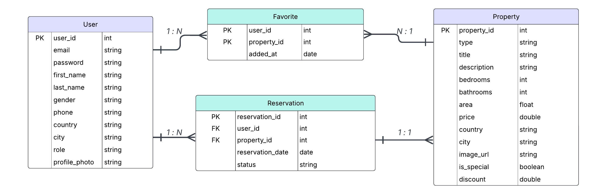

# 🏠 Luxora - Real Estate Agency Android App

A comprehensive real estate management Android application built with Java, featuring both customer and admin functionalities for property browsing, reservations, and administration.


## 📋 Table of Contents

- [🎯 Overview](#-overview)
- [✨ Features](#-features)
- [🎬 Demo Video](#-demo-video)
- [🛠 Technical Stack](#-technical-stack)
- [⚡ Quick Download APK](#-quick-download-apk)
- [🚀 Installation & Setup](#-installation--setup)
- [🔗 API Configuration](#-api-configuration)
- [📦 APK Release](#-apk-release)
- [📁 Project Structure](#-project-structure)
- [💾 Database Schema](#-database-schema)
- [👥 User Roles](#-user-roles)
- [🤝 Contributing](#-contributing)
- [👨‍💻 Contributors](#-contributors)
- [⚖️ License](#-license)

## 🎯 Overview

**Luxora** is a feature-rich real estate agency application that connects property seekers with available properties. The app provides a seamless experience for browsing properties, making reservations, and managing real estate operations through an intuitive admin panel.

The application supports two main user types:
- **Customers**: Browse properties, make reservations, manage favorites, and view special offers
- **Admins**: Manage properties, customers, reservations, special offers, and system analytics

## ✨ Features

### 🏃‍♂️ Customer Features
- **Property Browsing**: Search and filter properties by type, location, price, and features
- **Detailed Property Views**: High-quality images, comprehensive descriptions, and amenities
- **Reservation System**: Book property viewings with real-time status tracking
- **Favorites Management**: Save and organize preferred properties
- **Special Offers**: Access exclusive deals and discounted properties
- **Profile Management**: Update personal information and profile pictures
- **Authentication**: Secure login/registration with "Remember Me" functionality

### 👨‍💼 Admin Features
- **Dashboard Analytics**: Comprehensive statistics and data visualization
- **Property Management**: Add, edit, and manage property listings
- **Customer Management**: View and manage customer accounts
- **Reservation Management**: Approve, reject, and track property reservations
- **Special Offers**: Create and manage promotional campaigns
- **Admin Management**: Add and manage other admin accounts
- **Data Import**: Fetch properties from external APIs

### 🎨 UI/UX Features
- **Modern Material Design**: Clean, intuitive interface following Material Design principles
- **Responsive Layouts**: Optimized for various screen sizes and orientations
- **Smooth Animations**: Engaging transitions and interactive elements
- **Navigation Drawer**: Easy access to all app sections

## 🎬 Demo Video

<div align="center">

https://github.com/user-attachments/assets/819960d6-0a30-44e1-97ad-ed197828bfe0

</div>

## 🛠 Technical Stack

- **Language**: Java
- **Platform**: Android (Min SDK 26, Target SDK 35)
- **Database**: SQLite with custom helper classes
- **Image Loading**: Picasso library for efficient image handling
- **Architecture**: MVC (Model-View-Controller) pattern
- **API Integration**: RESTful API consumption with JSON parsing
- **UI Components**: Material Design Components
- **Build System**: Gradle with Kotlin DSL

## ⚡ Quick Download APK

### 🚀 Get the App Instantly (Recommended)

The easiest way to get Luxora is through GitHub Releases:

1. **Go to Releases**:
   - Click the **"Releases"** button on the right side of this GitHub repository page

2. **Download Latest APK**:
   - Find the latest release
   - Click on **"Luxora-v1.0.0.apk"** to download
   - The file will be saved to your device's Downloads folder

3. **Install the App**:
   - Open your device's file manager
   - Navigate to Downloads folder
   - Tap on the APK file and follow installation prompts

### 📋 System Requirements
- **Min Android Version**: Android 8.0 (API 26)
- **Target Android Version**: Android 15 (API 35)
- **Architecture**: Universal (supports all device architectures)
- **File Size**: ~15MB (approximate)

### 🔑 Default Login Credentials

**Admin Account**:
- Email: `admin@admin.com`
- Password: `Admin123!`

**Test Customer Account**:
- Register a new account through the app's registration flow

---

##  🚀 Installation & Setup

### Prerequisites
- Android Studio (latest version recommended)
- Android SDK API Level 26 or higher
- Java Development Kit (JDK) 11 or higher
- Git

### Steps to Run the Project

1. **Clone the Repository**
   ```bash
   git clone https://github.com/yourusername/luxora-real-estate.git
   cd luxora-real-estate/Android_Lab
   ```

2. **Open in Android Studio**
   - Launch Android Studio
   - Select "Open an existing Android Studio project"
   - Navigate to the cloned repository folder
   - Select the `Android_Lab` directory

3. **Sync Project**
   - Android Studio will automatically detect the project
   - Click "Sync Now" when prompted to sync Gradle files

4. **Build the Project**
   ```bash
   ./gradlew clean build
   ```
   Or use Android Studio's Build menu.

5. **Run the Application**
   - Connect an Android device or start an emulator
   - Click the "Run" button in Android Studio
   - The app will install and launch automatically

### Running via Command Line

If you prefer using the command line:

```bash
# Clean and build the project
./gradlew clean build

# Install on connected device
./gradlew installDebug

# Or build and install in one command
./gradlew clean installDebug
```

## 🔗 API Configuration

The application fetches property data from an external API. The API configuration is located in:

**File**: `app/src/main/java/com/example/a1210733_1211088_courseproject/api/PropertyApiClient.java`

### Current API Configuration

```java
// Current API URL
private static final String API_URL = "https://mocki.io/v1/c78b9a1b-dfaa-4a45-808d-3ffd83ef5622";

```

> **📋 API Content Reference**: You can view the complete API response structure and sample data in the `api_content` file in this repository.

### Changing the API URL

To use a different API endpoint:

1. **Locate the PropertyApiClient.java file**:
   ```
   app/src/main/java/com/example/a1210733_1211088_courseproject/api/PropertyApiClient.java
   ```

2. **Update the API_URL constant**:
   ```java
   private static final String API_URL = "YOUR_NEW_API_URL_HERE";
   ```

3. **Ensure API Response Format**:
   Your API should return JSON data in the following format:
   ```json
   [
     {
       "id": 1,
       "type": "Apartment",
       "title": "Luxury Downtown Apartment",
       "description": "Beautiful apartment in the heart of the city",
       "bedrooms": 2,
       "bathrooms": 2,
       "area": 1200.5,
       "price": 250000.0,
       "country": "USA",
       "city": "New York",
       "imageUrl": "https://example.com/image.jpg"
     }
   ]
   ```

4. **Rebuild the project** after making changes:
   ```bash
   ./gradlew clean build
   ```

### API Testing

The app includes API testing functionality:
- Launch the app and tap the "Connect" button on the welcome screen
- Monitor the logs for API response details
- Check the database for successfully imported properties

### Creating Your Own API Content

If you want to create your own property data API:

1. **Use services like**:
   - [Mocki.io](https://mocki.io) (Free JSON API mock service)
   - [JSONBin.io](https://jsonbin.io)
   - Your own REST API server

2. **JSON Structure Requirements**:
   - Each property must have all required fields
   - Image URLs should be publicly accessible
   - Price values should be numeric
   - Area values should be numeric (square feet)

3. **Test Your API**:
   - Verify the endpoint returns valid JSON
   - Check CORS settings if hosting your own API
   - Ensure images load correctly

## 📦 APK Release

### Alternative Download Method

A pre-built APK file is also available directly in the repository:

**Location**: `app/release/app-release.apk`

### Installation Instructions

1. **Download the APK**:
   - Navigate to the `app/release/` folder in this repository
   - Download the `app-release.apk` file

2. **Enable Installation from Unknown Sources**:
   - Go to Settings > Security (or Privacy)
   - Enable "Install from Unknown Sources" or "Allow from this source"

3. **Install the APK**:
   - Open the downloaded APK file
   - Follow the installation prompts
   - Launch the app from your app drawer

## 📁 Project Structure

```
Android_Lab/
├── app/
│   ├── src/
│   │   ├── main/
│   │   │   ├── java/com/example/a1210733_1211088_courseproject/
│   │   │   │   ├── activities/          # Main application activities
│   │   │   │   ├── adapters/           # RecyclerView adapters
│   │   │   │   ├── api/                # API client and HTTP management
│   │   │   │   ├── auth/               # Authentication management
│   │   │   │   ├── database/           # SQLite database helpers
│   │   │   │   ├── fragments/          # UI fragments
│   │   │   │   ├── models/             # Data models
│   │   │   │   ├── utils/              # Utility classes
│   │   │   │   └── views/              # Custom view components
│   │   │   ├── res/                    # Resources (layouts, drawables, values)
│   │   │   └── AndroidManifest.xml
│   │   └── test/                       # Unit tests
│   ├── build.gradle.kts               # App-level build configuration
│   └── release/
│       └── app-release.apk            # Pre-built APK file
├── gradle/                            # Gradle wrapper files
├── build.gradle.kts                   # Project-level build configuration
├── settings.gradle.kts               # Project settings
└── README.md                         # This file
```

### Key Components

#### Activities
- **MainActivity**: Welcome screen with API connection
- **authActivity**: Login and registration
- **HomeActivity**: Customer dashboard with navigation
- **AdminActivity**: Admin dashboard and management

#### Fragments
- **Customer Fragments**: Home, Properties, Favorites, Reservations, Profile, Contact
- **Admin Fragments**: Dashboard, Properties Management, Customer Management, Reservations, Special Offers, Admin Management

#### Database
- **DataBaseHelper**: SQLite database management
- **Models**: User, Property, Reservation entities
- **Queries**: SQL query management classes

## 💾 Database Schema



### Tables Overview

1. **Users Table**
   - User authentication and profile information
   - Supports both customers and admins
   - Fields: *userId*, *email*, *password*, *firstName*, *lastName*, *gender*, *country*, *city*, *phone*, *role*, *profileImage*

2. **Properties Table**
   - Property listings and details
   - Fields: *propertyId*, *type*, *title*, *description*, *bedrooms*, *bathrooms*, *area*, *price*, *country*, *city*, *imageUrl*, *isSpecial*, *discount*

3. **Reservations Table**
   - Property reservation tracking
   - Fields: *reservationId*, *userId*, *propertyId*, *reservationDate*, *status*, *notes*

4. **Favorites Table**
   - User's favorite properties
   - Fields: *favoriteId*, *userId*, *propertyId*, *dateAdded*

## 👥 User Roles

### Customer Role
- Browse and search properties
- Make and manage reservations
- Add properties to favorites
- View special offers
- Update profile information

### Admin Role
- Full dashboard with analytics
- Manage all properties
- View and manage customers
- Approve/reject reservations
- Create special offers
- Manage other admin accounts
- Import data from APIs

## 🤝 Contributing

We welcome contributions to improve Luxora! Here's how you can help:

### Getting Started
1. Fork the repository
2. Create a feature branch (`git checkout -b feature/amazing-feature`)
3. Commit your changes (`git commit -m 'Add amazing feature'`)
4. Push to the branch (`git push origin feature/amazing-feature`)
5. Open a Pull Request

### Areas for Contribution
- 🐛 Bug fixes and stability improvements
- ✨ New features and enhancements
- 📱 UI/UX improvements
- 🧪 Test coverage expansion
- 📚 Documentation updates
- 🌐 Internationalization/Localization

### Development Guidelines
- Test your changes thoroughly
- Follow the existing code style
- Update documentation as needed
- Add tests for new features
- Ensure the app builds successfully

## �‍�💻 Contributors

<div align="center">

### 🚀 Meet the Team Behind Luxora

<br>

<table>
<tr>
<td align="center" width="50%">

<br><br>
<strong>🌟 Osaid Nur</strong>
<br><br>
<a href="https://github.com/osaidnur">

</a>
</td>
<td align="center" width="50%">

<br><br>
<strong>🌟 Doaa Hatu</strong>
<br><br>
<a href="https://github.com/doaahatu">

</a>
</td>
</tr>
</table>

<br>

*Built with ❤️ and countless hours of coding*

</div>


## ⚖️ License

This project is licensed under the MIT License - see the [LICENSE](LICENSE) file for details.

---

**Made with ❤️ for the Real Estate Community**

*This project was developed as part of a course project demonstrating Android development skills, database management, API integration, and modern UI/UX design principles.*
